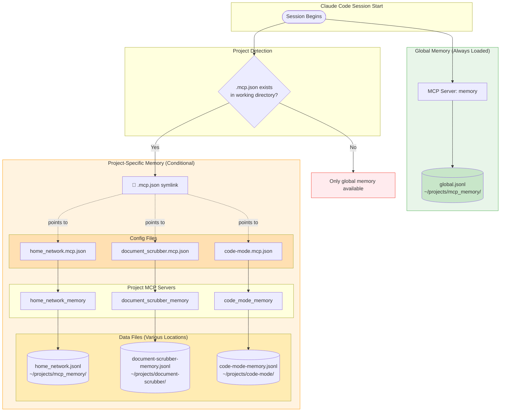
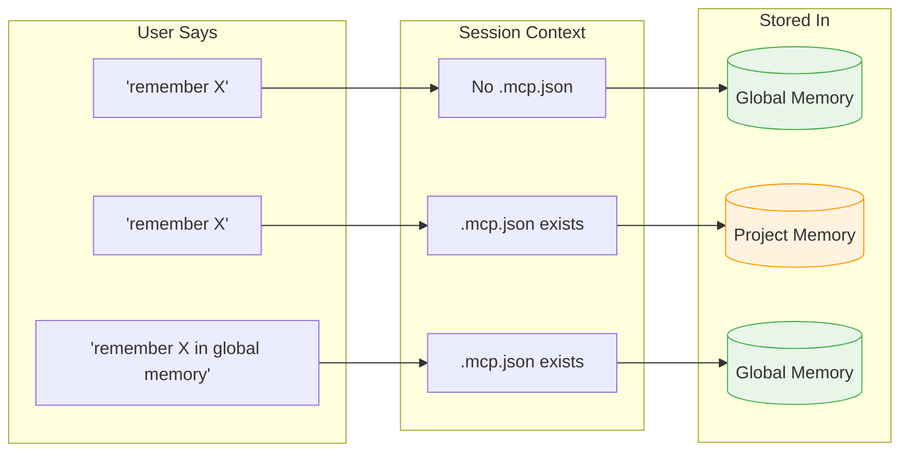
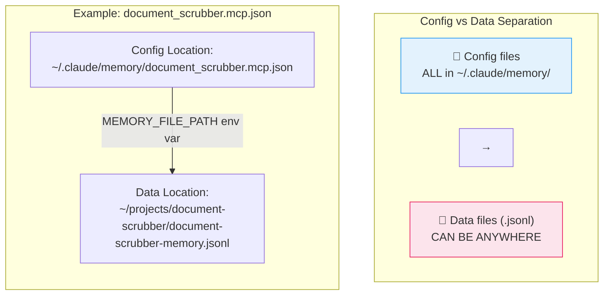
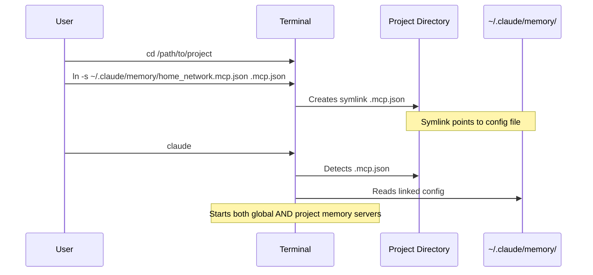

# MCP Memory System Architecture

## System Overview

```mermaid
flowchart TB
    subgraph SESSION["Claude Code Session Start"]
        START([Session Begins])
    end

    subgraph GLOBAL["Global Memory (Always Loaded)"]
        GM_SERVER["MCP Server: memory"]
        GM_DATA[("global.jsonl<br/>~/projects/mcp_memory/")]
        GM_SERVER --> GM_DATA
    end

    subgraph CHECK["Project Detection"]
        CWD{".mcp.json exists<br/>in working directory?"}
    end

    subgraph PROJECT["Project-Specific Memory (Conditional)"]
        SYMLINK["📎 .mcp.json symlink"]

        subgraph CONFIGS["Config Files<br/>~/.claude/memory/"]
            CFG1["home_network.mcp.json"]
            CFG2["document_scrubber.mcp.json"]
            CFG3["code-mode.mcp.json"]
        end

        subgraph SERVERS["Project MCP Servers"]
            SRV1["home_network_memory"]
            SRV2["document_scrubber_memory"]
            SRV3["code_mode_memory"]
        end

        subgraph DATA["Data Files (Various Locations)"]
            DAT1[("home_network.jsonl<br/>~/projects/mcp_memory/")]
            DAT2[("document-scrubber-memory.jsonl<br/>~/projects/document-scrubber/")]
            DAT3[("code-mode-memory.jsonl<br/>~/projects/code-mode/")]
        end

        SYMLINK -.->|"points to"| CFG1
        SYMLINK -.->|"points to"| CFG2
        SYMLINK -.->|"points to"| CFG3
        CFG1 --> SRV1 --> DAT1
        CFG2 --> SRV2 --> DAT2
        CFG3 --> SRV3 --> DAT3
    end

    START --> GM_SERVER
    START --> CWD
    CWD -->|"No"| ONLY["Only global memory available"]
    CWD -->|"Yes"| SYMLINK

    style GLOBAL fill:#e8f5e9,stroke:#4caf50
    style GM_DATA fill:#c8e6c9
    style PROJECT fill:#fff3e0,stroke:#ff9800
    style CONFIGS fill:#ffe0b2
    style DATA fill:#ffecb3
    style ONLY fill:#ffebee,stroke:#f44336
```

## "Remember" Command Routing

```mermaid
flowchart LR
    subgraph INPUT["User Says"]
        R1["'remember X'"]
        R2["'remember X'"]
        R3["'remember X in global memory'"]
    end

    subgraph CONTEXT["Session Context"]
        C1["No .mcp.json"]
        C2[".mcp.json exists"]
        C3[".mcp.json exists"]
    end

    subgraph DEST["Stored In"]
        D1[("Global Memory")]
        D2[("Project Memory")]
        D3[("Global Memory")]
    end

    R1 --> C1 --> D1
    R2 --> C2 --> D2
    R3 --> C3 --> D3

    style D1 fill:#e8f5e9,stroke:#4caf50
    style D2 fill:#fff3e0,stroke:#ff9800
    style D3 fill:#e8f5e9,stroke:#4caf50
```

## Key Concepts

```mermaid
flowchart TB
    subgraph SEPARATION["Config vs Data Separation"]
        direction LR
        CENTRAL["📁 Config files<br/>ALL in ~/.claude/memory/"]
        ARROW["→"]
        DISTRIBUTED["📁 Data files (.jsonl)<br/>CAN BE ANYWHERE"]
    end

    subgraph EXAMPLE["Example: document_scrubber.mcp.json"]
        direction TB
        CONFIG_LOC["Config Location:<br/>~/.claude/memory/document_scrubber.mcp.json"]
        DATA_LOC["Data Location:<br/>~/projects/document-scrubber/document-scrubber-memory.jsonl"]
        CONFIG_LOC -->|"MEMORY_FILE_PATH env var"| DATA_LOC
    end

    style CENTRAL fill:#e3f2fd,stroke:#2196f3
    style DISTRIBUTED fill:#fce4ec,stroke:#e91e63
```

## Enabling Project Memory

```mermaid
sequenceDiagram
    participant User
    participant Terminal
    participant Project as Project Directory
    participant Config as ~/.claude/memory/

    User->>Terminal: cd /path/to/project
    User->>Terminal: ln -s ~/.claude/memory/home_network.mcp.json .mcp.json
    Terminal->>Project: Creates symlink .mcp.json
    Note over Project,Config: Symlink points to config file

    User->>Terminal: claude
    Terminal->>Project: Detects .mcp.json
    Terminal->>Config: Reads linked config
    Note over Terminal: Starts both global AND project memory servers
```
